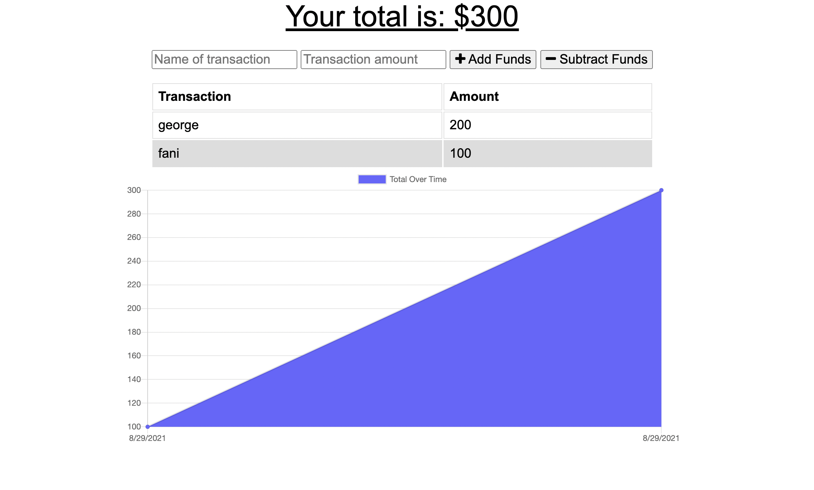
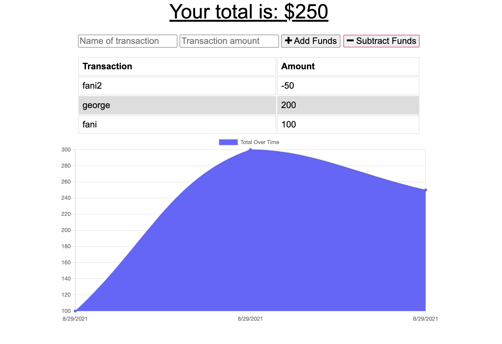

# budget-tracker

 ## Link to deployed application/Repository:  
  https://budget-tracking-application1.herokuapp.com/

 # Table of contents  
 -[Description](#Description)  
 -[User Story](#UserStory)  
 -[Badges](#Badges)  
 -[Screenshot](#Screenshot)  
 -[Installation](#Installation)  
 -[Usage](#Usage)  
 -[Support](#Support)  
 -[Contributions](#Contributions)  
 -[Authors](#Authors)  
 -[License](#Licence)  

  ## Description:  
  An application for money tracking that works both online and offline

  ##User Story:  
  j
  
  ## Badges:  
  
  
  ## Screenshot:  

  
  ## Installation:  
  npm i   
  npm start   
  Open local host:3001

  
  ## Support:  
  Contact us by email at: deltorofanie@gmail.com  
  Contact us at Github at: https://github.com/fanidt

  ## Contributions:  
  No contributions allowed

  ## Authors:  
  fanidt
  
  ## Licence:  
  MIT  
  License Link: https://opensource.org/licenses/MIT

